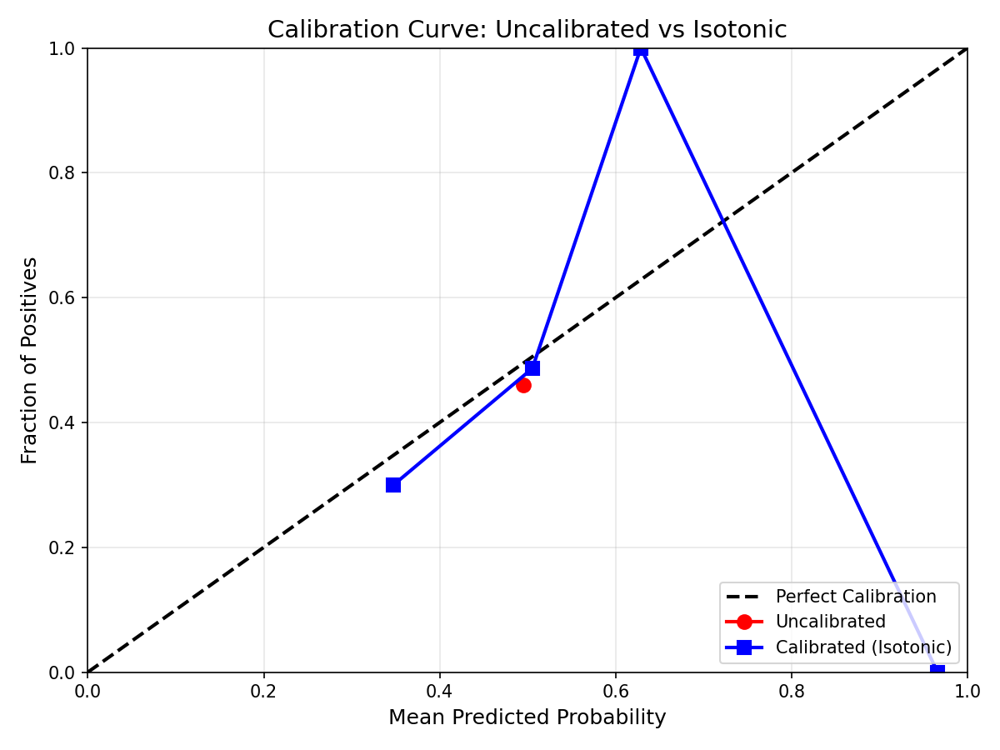

# Model Report: Logistic Regression

## Overview
Logistische Regression zur Vorhersage der Preisrichtung (Up/Down) basierend auf Chainlink Oracle Daten.

## Features
| Feature | Beschreibung |
|---------|--------------|
| oracle_lag_pct | Preisänderung zum vorherigen Update in % |
| sigma | Rollende Standardabweichung der letzten 10 Preise |
| momentum | Log-Return der letzten 3 Updates |

## Modell
- **Typ:** Logistische Regression
- **Regularisierung:** L2 (Ridge)
- **Lambda:** 0.1 (C=10 in sklearn-Notation)
- **Normalisierung:** Z-Score (pro Fold auf Trainingsdaten berechnet)

## Walk-Forward Backtest

### Konfiguration
- **Train Size:** 700 Zeilen
- **Test Size:** 100 Zeilen
- **Geplante Folds:** 5
- **Tatsächliche Folds:** 2 (limitiert durch Datenmenge: 993 Feature-Zeilen)

### Ergebnisse pro Fold

| Fold | Train Range | Test Range | Brier Score | Accuracy | Win Rate |
|------|-------------|------------|-------------|----------|----------|
| 1 | [0:700] | [700:800] | 0.2522 | 49.00% | 72.73% |
| 2 | [100:800] | [800:900] | 0.2483 | 53.00% | 52.63% |

### Durchschnitt

| Metrik | Wert |
|--------|------|
| Brier Score | 0.2502 |
| Accuracy | 51.00% |
| Win Rate | 62.68% |

## Interpretation

### Brier Score (0.2502)
- Bereich: 0 (perfekt) bis 1 (komplett falsch)
- 0.25 entspricht zufälligem Raten bei 50/50 Verteilung
- **Fazit:** Modell zeigt keine Verbesserung gegenüber Zufall

### Accuracy (51.00%)
- Knapp über 50% (Baseline bei ausgeglichener Verteilung)
- **Fazit:** Kaum besser als Münzwurf

### Win Rate (62.68%)
- Precision für "Up" Vorhersagen
- Hohe Varianz zwischen Folds (72.73% vs 52.63%)
- **Fazit:** Instabil, möglicherweise durch kleine Testsets

## Isotonische Kalibrierung

### Setup
- **Methode:** Pool Adjacent Violators (PAV) Algorithmus
- **Calibration Train:** 50 Samples (Test-Indices 0-49)
- **Calibration Test:** 50 Samples (Test-Indices 50-99)

### Ergebnisse

| Metrik | Vor Kalibrierung | Nach Kalibrierung | Änderung |
|--------|------------------|-------------------|----------|
| Brier Score | 0.2478 | 0.2549 | +0.0071 (+2.9%) |

### Calibration Curve

### Fazit zur Kalibrierung

Die isotonische Kalibrierung hat den Brier Score **leicht verschlechtert** (+2.9%).

**Gründe:**
1. **Zu wenig Daten:** 50 Samples für Calibration Training sind unzureichend
2. **Overfitting:** Isotonische Regression passt sich dem Rauschen an, nicht dem Signal
3. **Kein echtes Signal:** Das Basismodell performt auf Zufallsniveau — es gibt nichts zu kalibrieren

**Empfehlung:** Kalibrierung erst sinnvoll, wenn:
- Das Modell echte Vorhersagekraft zeigt (Brier < 0.24)
- Mehr Daten für Calibration verfügbar sind (>200 Samples)

## Limitierungen
1. **Wenig Daten:** Nur 2 Folds möglich statt geplanter 5
2. **Kurzer Zeitraum:** 1003 Datenpunkte = wenige Stunden Chainlink-Daten
3. **Feature-Limitierung:** Nur On-Chain Features, keine externen Signale

## Nächste Schritte (Phase A)

> **Wichtig:** Das Modell braucht mehr Features für finales Training.

### Feature-Erweiterungen für Phase A:
- **Externe Preisdaten:** Binance/Coinbase Spot-Preise als Lead-Indikator
- **Orderbook-Features:** Bid-Ask Spread, Imbalance
- **Volatilität:** GARCH, Realized Volatility
- **Markt-Regime:** Trend vs. Range Detection

### Daten-Erweiterungen:
- Mehr historische Chainlink-Updates sammeln (>10.000 Zeilen)
- Cross-Validierung mit mehr Folds ermöglichen
- Out-of-Sample Testing auf neuen Daten
