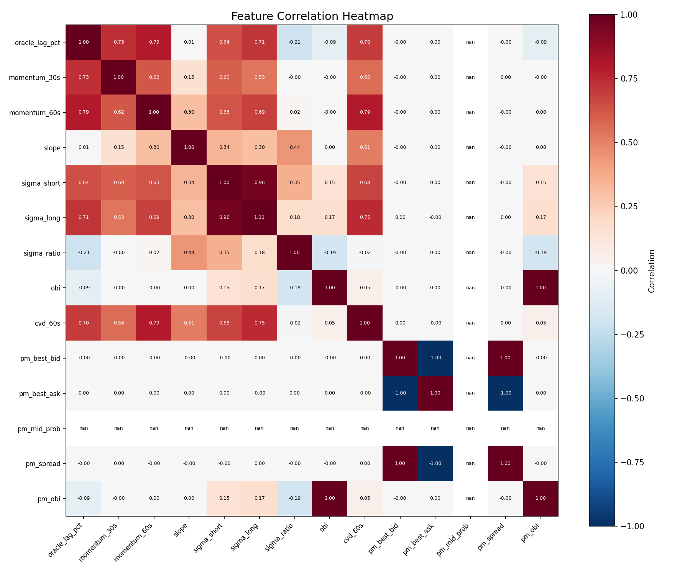

# Model Report: Logistic Regression

## Overview
Logistische Regression zur Vorhersage der Preisrichtung (Up/Down) basierend auf Chainlink Oracle und Polymarket Daten.

---

## Version 2: Full Feature Set (Person A Pipeline)

### Datenquelle
- **Input:** `person-a/data/phase3_features_with_pm.csv`
- **Labels:** Abgeleitet aus `spot_price_usd` (Up wenn next > current)
- **Samples:** 108 (nach Filterung von SAME-Bewegungen)
- **Label-Verteilung:** 49.1% Up, 50.9% Down

### Features (14 von 17 nutzbar)

| Feature | Coverage | Beschreibung |
|---------|----------|--------------|
| oracle_lag_pct | 100% | Oracle vs Spot Differenz % |
| momentum_30s | 82% | Log-Return 30 Sekunden |
| momentum_60s | 70% | Log-Return 60 Sekunden |
| slope | 77% | Lineare Regression letzte 10 Werte |
| sigma_short | 99% | EWMA Volatilität (λ=0.94) |
| sigma_long | 99% | EWMA Volatilität (λ=0.97) |
| sigma_ratio | 98% | sigma_short / sigma_long |
| obi | 100% | Orderbook Imbalance [-1, 1] |
| cvd_60s | 100% | Cumulative Volume Delta |
| pm_best_bid | 100% | Polymarket Best Bid |
| pm_best_ask | 100% | Polymarket Best Ask |
| pm_mid_prob | 100% | Polymarket Mid Probability |
| pm_spread | 100% | Polymarket Spread |
| pm_obi | 100% | Polymarket OBI |

**Nicht nutzbar:** tau, tau_sq, funding_rate (0% Coverage)

### Korrelations-Heatmap

### Walk-Forward Backtest

**Konfiguration:**
- Train Size: 60 Zeilen
- Test Size: 20 Zeilen
- Folds: 2

| Fold | Train Range | Test Range | Brier Score | Accuracy | Win Rate |
|------|-------------|------------|-------------|----------|----------|
| 1 | [0:60] | [60:80] | 0.2457 | 55.00% | 55.00% |
| 2 | [20:80] | [80:100] | 0.2789 | 45.00% | 43.75% |

### Durchschnitt v2

| Metrik | Wert | vs. v1 |
|--------|------|--------|
| Brier Score | 0.2623 | +0.0121 (schlechter) |
| Accuracy | 50.00% | -1.00% |
| Win Rate | 49.38% | -13.30% |

### Isotonische Kalibrierung v2

| Metrik | Vor | Nach | Änderung |
|--------|-----|------|----------|
| Brier Score | 0.2731 | 0.2778 | +1.7% |

### Fazit v2

**Ziel nicht erreicht:** Brier Score 0.2623 > 0.24 (Ziel)

**Gründe:**
1. **Zu wenig Daten:** Nur 108 Samples nach Filterung
2. **Feature-Qualität:** Polymarket-Features (pm_*) sind fast konstant (Spread=0.998)
3. **Kein Edge:** Mit sekündlichen Spot-Preisen kein vorhersagbares Signal

**Beobachtungen:**
- Mehr Features (14 vs 3) haben Ergebnis **nicht verbessert**
- Polymarket-Daten zeigen wenig Varianz (illiquider Markt?)
- Modell performt weiterhin auf Zufallsniveau

---

## Version 1: Baseline (3 Features)

### Features
| Feature | Beschreibung |
|---------|--------------|
| oracle_lag_pct | Preisänderung zum vorherigen Update in % |
| sigma | Rollende Standardabweichung der letzten 10 Preise |
| momentum | Log-Return der letzten 3 Updates |

### Modell
- **Typ:** Logistische Regression
- **Regularisierung:** L2 (Ridge)
- **Lambda:** 0.1 (C=10 in sklearn-Notation)
- **Normalisierung:** Z-Score (pro Fold auf Trainingsdaten berechnet)

### Walk-Forward Backtest v1

**Konfiguration:**
- Train Size: 700 Zeilen
- Test Size: 100 Zeilen
- Folds: 2 (limitiert durch Datenmenge: 993 Feature-Zeilen)

| Fold | Train Range | Test Range | Brier Score | Accuracy | Win Rate |
|------|-------------|------------|-------------|----------|----------|
| 1 | [0:700] | [700:800] | 0.2522 | 49.00% | 72.73% |
| 2 | [100:800] | [800:900] | 0.2483 | 53.00% | 52.63% |

### Durchschnitt v1

| Metrik | Wert |
|--------|------|
| Brier Score | 0.2502 |
| Accuracy | 51.00% |
| Win Rate | 62.68% |

### Isotonische Kalibrierung v1

| Metrik | Vor Kalibrierung | Nach Kalibrierung | Änderung |
|--------|------------------|-------------------|----------|
| Brier Score | 0.2478 | 0.2549 | +2.9% |

---

## Gesamtfazit

| Version | Features | Samples | Brier Score | Status |
|---------|----------|---------|-------------|--------|
| v1 (Baseline) | 3 | 993 | 0.2502 | Zufall |
| v2 (Full) | 14 | 108 | 0.2623 | Zufall |

**Problem:** Beide Versionen performen auf Zufallsniveau (~0.25 Brier).

## Nächste Schritte

### Kritisch: Mehr Daten sammeln
- Aktuell: ~100-200 nutzbare Samples
- Benötigt: >1.000 Samples für robuste Validierung
- Person A: Längere Live-Datensammlung durchführen

### Feature-Engineering
- tau/tau_sq aktivieren (Zeit bis Expiry)
- funding_rate integrieren
- Prüfen warum Polymarket-Features wenig Varianz zeigen

### Alternative Ansätze
- Label-Definition überdenken (Oracle-Updates statt Spot-Sekunden?)
- Längere Vorhersage-Horizonte (5min statt 1sec)
- Ensemble-Methoden wenn mehr Daten verfügbar
